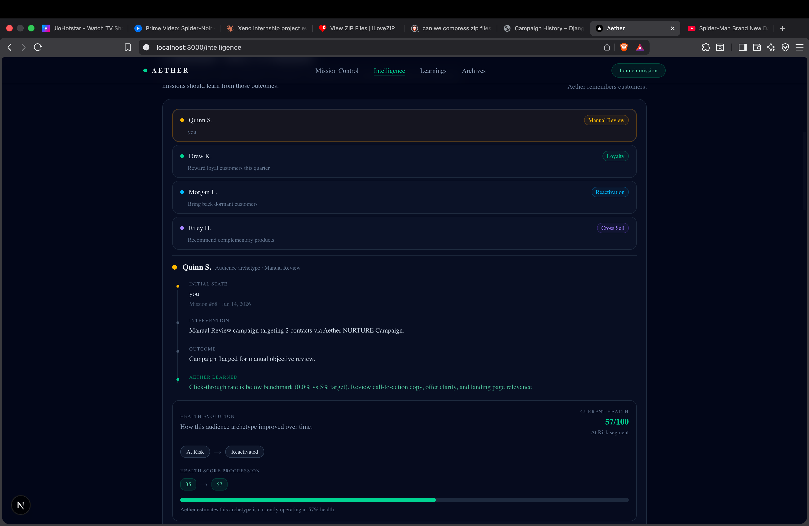
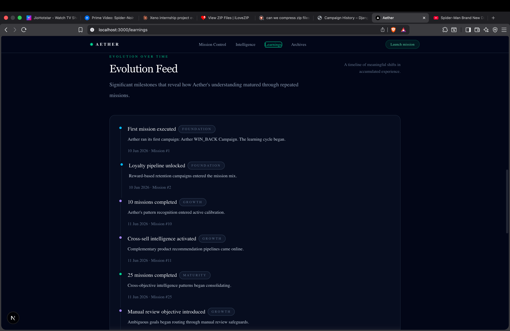
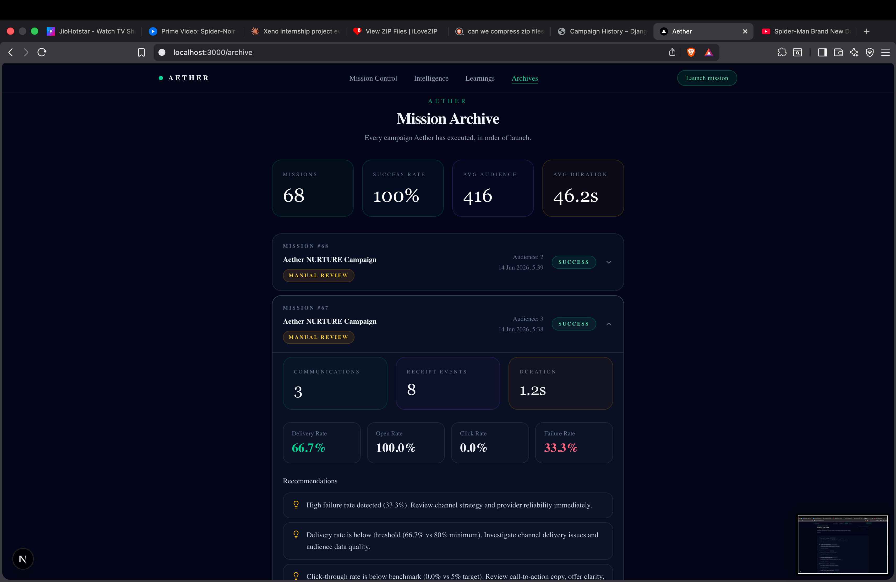

<div align="center">

<br />

# ✦ AETHER

### Goal-Driven Marketing Intelligence

*Define the outcome. Aether handles the rest.*

<br />


<br />

</div>

---

## Overview

Aether is a goal-driven marketing intelligence platform built for teams that think in outcomes, not workflows.

Where traditional CRM dashboards begin with data tables and filters, Aether begins with business intent. A marketer states what they want to accomplish — *bring back dormant customers*, *reward loyal buyers this quarter*, *recommend complementary products* — and Aether orchestrates the entire campaign execution pipeline while surfacing explainable intelligence at every step.

The frontend is designed around a single principle: **autonomous decisions should be transparent**. Every campaign objective, audience selection, channel choice, and recommendation is exposed, traceable, and understandable by the humans who depend on it.

---

## The Problem

Modern marketing platforms expose data, but rarely explain decisions.

Teams navigate dashboards, configure campaigns manually, and struggle to understand why particular audiences succeed while others fail. Important context is often scattered across multiple tools.

## Aether's Approach

Aether starts with intent.

Marketers define the business outcome they want to achieve, while Aether transforms that objective into an explainable execution pipeline.

Every mission contributes to a growing body of intelligence that influences future decisions.

---

## Live Demo

Frontend: *(Add Vercel URL after deployment)*

Backend API: *(Render deployment URL)*

Aether is designed as a fully deployed, end-to-end marketing intelligence system:

```
Vercel Frontend
       ↓
Render Backend (Django)
       ↓
Supabase PostgreSQL
```

---

## Screenshots

### Mission Control
*Define a marketing objective in plain language and configure your audience strategy.*


### Intelligence
*Understand how Aether perceives individual customer archetypes — including health evolution, past interventions, and lessons learned.*



### Learnings
*A living record of the platform's accumulated experience — milestones, pattern shifts, and strategic observations derived from real mission history.*



### Mission Archive
*Every campaign Aether has executed, in order of launch — with full metrics, recommendations, and expandable detail panels.*



---

## Core Experiences

### 1. Mission Control

The primary entry point into Aether. Marketers define a business outcome using natural language, and the platform interprets, plans, and executes the appropriate campaign pipeline.

**Features:**
- Natural-language goal input with suggested objective prompts
- Audience strategy configuration — let Aether recommend a size or override it manually
- Deterministic campaign execution routed through a structured pipeline
- Guided launch experience with clear confirmation before execution

**Example objectives:**
```
Bring back dormant customers
Reward loyal customers this quarter
Recommend complementary products
Reduce churn among wellness customers
```

---

### 2. Intelligence

The Intelligence view exposes how Aether understands and tracks individual customer archetypes across campaigns. It does not simply produce recommendations — it remembers outcomes, tracks health over time, and explains the reasoning behind each intervention.

**Features:**
- **Customer Story Evolution** — a chronological view of initial state, campaign intervention, outcome, and lesson learned
- **Health Score Visualization** — numeric health scores and segment transitions (e.g. *At Risk → Reactivated*)
- **Campaign Selection Reasoning** — which campaign type was applied and why
- **Product Affinity Signals** — patterns surfaced from purchase and engagement history
- **Strategic Memory** — how past interventions inform future targeting decisions
- **Learning Loop** — closes the feedback cycle between execution and intelligence

---

### 3. Learnings

The Learnings section represents accumulated organizational intelligence — the platform reflecting on its own history to surface recurring patterns, strategic observations, and inflection points across missions.

**Features:**
- **Learning Profile** — a summary of Aether's current knowledge state
- **Internalized Lessons** — distilled insights from campaign outcomes
- **Evolution Feed** — a timeline of meaningful milestones tagged by stage (*Foundation*, *Growth*, *Maturity*)
- **Observed Patterns** — recurring behaviors identified across objectives and segments
- **Experience Synthesis** — cross-mission intelligence that informs future decisions

The Evolution Feed reads like an operational biography: *First mission executed. Loyalty pipeline unlocked. 25 missions completed — cross-objective patterns began consolidating.*

---

### 4. Mission Archive

A complete historical record of every campaign Aether has executed. The Archive functions as both an operational log and a source of forward-looking intelligence.

**Features:**
- Aggregate statistics: total missions, success rate, average audience size, average execution duration
- Per-mission summaries with objective type, audience count, and launch timestamp
- Expandable detail panels showing communications generated, receipt events processed, and execution duration
- Performance metrics: delivery rate, open rate, click-through rate, failure rate
- Outcome-derived recommendations surfaced at the mission level
- Status badges and objective-type labels for rapid scanning

---

## Product Philosophy

Aether is built around five design convictions:

**Goal-driven over feature-driven.** Marketers should specify what they want to achieve, not navigate a sequence of configuration screens. The interface shapes itself around intent.

**Explainability over black-box automation.** Every decision Aether makes — audience selection, campaign type, channel routing — is traceable. The platform earns trust by showing its work.

**Deterministic intelligence over unpredictability.** Campaign execution follows a defined pipeline. Stages are visible, statuses are reported, and failures surface recommendations rather than silent degradation.

**End-to-end ownership over fragmented tools.** From goal definition to mission archival to accumulated learning, Aether maintains continuity across the entire campaign lifecycle in a single interface.

**Elegant interfaces that simplify complex decisions.** The visual language is deliberate — dark, focused, high-contrast — designed to reduce cognitive load and surface only what matters at each stage.

---

## Architecture

The frontend mirrors the lifecycle of a marketing mission:

```
Mission Control          ← Goal input and audience configuration
       ↓
Campaign Execution       ← Pipeline orchestration (Goal Parser → Audience Selector → Campaign Planner → Channel Service)
       ↓
Mission Archive          ← Persistent record with full metrics and recommendations
       ↓
Insights Generation      ← Outcome analysis and failure signals
       ↓
Customer Intelligence    ← Per-archetype health tracking and story evolution
       ↓
Evolution Feed           ← Accumulated platform learning over time
```

State is managed through React Query with server-side data fetching via Next.js App Router. The pipeline status model maps directly to backend stage responses, making execution transparency a first-class concern rather than an afterthought.

---

## Tech Stack

| Layer | Technology |
|---|---|
| Framework | Next.js 16 (App Router) |
| UI Library | React 19 |
| Language | TypeScript 5 |
| Styling | Tailwind CSS 4 |
| Animation | Framer Motion 12 |
| Data Fetching | TanStack React Query 5 |
| Components | Radix UI + shadcn/ui |
| Icons | Lucide React |
| Utilities | clsx, tailwind-merge |

---

## Project Structure

```
src/
├── app/
│   ├── mission-control/       # Goal input, audience config, campaign launch
│   ├── intelligence/          # Customer archetypes, health scores, story evolution
│   ├── learnings/             # Evolution feed, observed patterns, experience synthesis
│   └── archive/               # Mission history, metrics, expandable detail panels
│
├── components/
│   ├── mission-control/       # GoalInput, AudienceStrategy, LaunchButton
│   ├── intelligence/          # CustomerStory, HealthEvolution, CampaignReasoning
│   ├── learnings/             # EvolutionFeed, LearningProfile, PatternList
│   └── archive/               # MissionCard, MetricsSummary, RecommendationList
│
├── hooks/                     # Data fetching hooks (useCampaigns, useMissionById, etc.)
├── lib/                       # API clients, type definitions, utility functions
└── providers/                 # React Query provider, global state
```

---

## Local Development

**Prerequisites:** Node.js 18+, npm 9+

```bash
# Clone the repository
git clone <repository-url>
cd aether-frontend

# Install dependencies
npm install

# Start the development server
npm run dev
```

The application will be available at **http://localhost:3000**.

**Environment variables** — create a `.env.local` file at the root:

```env
# Local development
NEXT_PUBLIC_API_BASE_URL=http://localhost:8000

# Production
# NEXT_PUBLIC_API_BASE_URL=https://your-render-backend.onrender.com
```

---

## Available Scripts

```bash
npm run dev        # Start development server with hot reload
npm run build      # Build for production
npm run start      # Start production server
npm run lint       # Run ESLint
```

---

## Deployment

Aether's frontend is intended to be deployed on Vercel and integrated with the Render-hosted Django backend.

Deployment workflow:

1. Push the repository to GitHub
2. Import the project in Vercel
3. Set the `NEXT_PUBLIC_API_BASE_URL` environment variable to your backend URL
4. Deploy

The production frontend communicates directly with the deployed backend through the `NEXT_PUBLIC_API_BASE_URL` environment variable. Ensure the backend has CORS configured appropriately before publishing the frontend URL.

Production builds are optimized automatically via Next.js static analysis and Vercel's edge network.

---

## Roadmap

Planned enhancements for future releases:

- **Authentication & Authorization** — user accounts, role-based access, team workspaces
- **Live Campaign Monitoring** — real-time pipeline status with WebSocket updates during execution
- **Cross-Mission Intelligence Synthesis** — surface patterns and anomalies that span multiple campaign objectives
- **Advanced Audience Simulations** — preview expected reach and estimated performance before launch
- **Enhanced Execution Visualizations** — animated pipeline stage progression during live runs
- **Export & Reporting** — downloadable mission summaries and performance reports

---

## Contributing

Pull requests are welcome. For significant changes, please open an issue first to discuss what you would like to change.

1. Fork the repository
2. Create a feature branch (`git checkout -b feature/your-feature`)
3. Commit your changes (`git commit -m 'Add your feature'`)
4. Push to the branch (`git push origin feature/your-feature`)
5. Open a pull request

---

<div align="center">

Built with precision. Designed for clarity.

**Aether** — *Marketing intelligence that explains itself.*

</div>